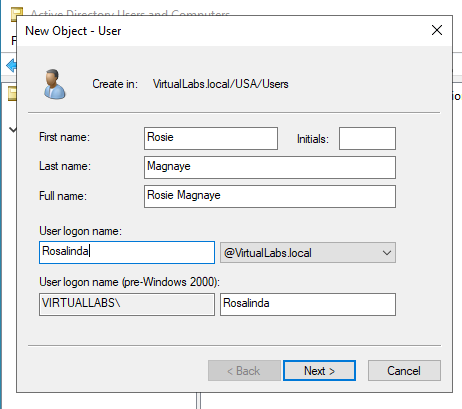
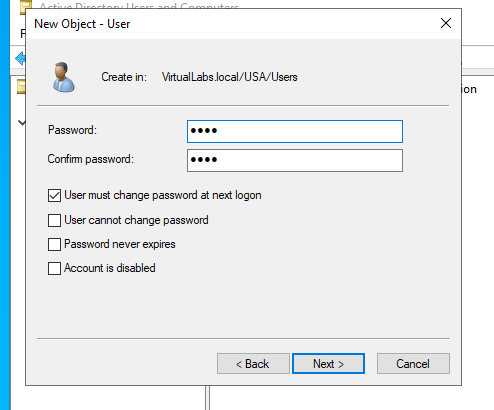
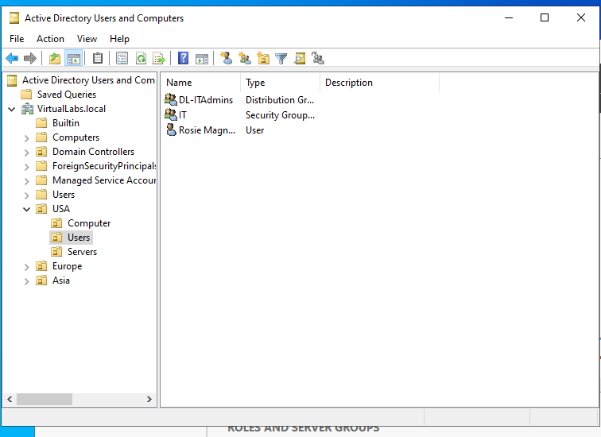

# Active Directory — User Setup

## Description

A basic Active Directory lab showing the new hire onboarding process. It covers setting up a new user account, issuing a temporary password, forcing a password update on first login, and placing the account into the appropriate Organizational Unit (OU).

## Environment Used

- Windows Server 2022
- VMware Workstation

## Lab walk-through

Creating a new user account in Active Directory:

Assigning a temporary password and enforcing password change at next logon:

Verifying user placement in the correct Organizational Unit (OU):

