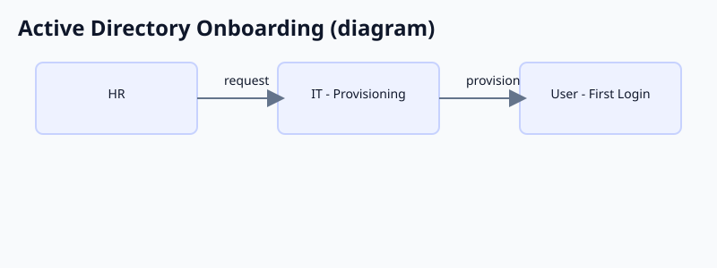

# Active-Directory-User-Setup

<h2>Description</h2>

A basic Active Directory lab showing the new hire onboarding process. It covers setting up a new user account, issuing a temporary password, forcing a password update on first login, and placing the user in the correct groups.

<h2>Environment Used</h2>

- Windows Server 2022 
- VMware Workstation

<h2>Lab Walkthrough</h2>

